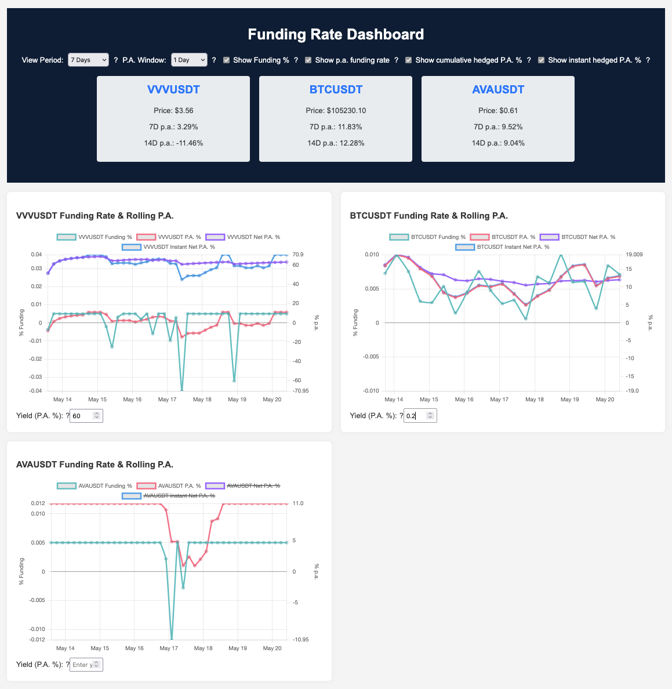

# Funding Rate Tools

This project provides tools to fetch, store, and analyze perpetual swap funding rates (currently from Binance and Hyperliquid). It includes a command-line utility to calculate and display per annum (p.a.) funding rates and a dashboard generator to visualize historical funding rates and current prices.

## Use case

This tool's aim is to understand the history of funding rates with a specific goal of seeing how much will you pay for a hedged position (owning the underlying + shorting it, usually against USD).

If you have a token that generates yield, it will also calculate the final historical yield by calculating the cost of holding the hedge too.

*Based explanation*: If you need to hold a **shitcoin** for something, but don't want to risk being rugpulled, short it to stay in USD. But before doing that, see if you won't pay too much in the funding of the short.

## Screenshot



## Features

- Fetches historical funding rates from Binance/Hyperliquid APIs.
- Stores data in a local SQLite database to avoid redundant fetches.
- Calculates p.a. funding rates from a short position perspective.
- Command-line interface (CLI) for:
    - Refreshing funding rate data.
    - Calculating p.a. rates for various periods (last day, week, month, or since a specific date).
    - Handling multiple trading pairs.
- Generates an interactive HTML dashboard:
    - Displays funding rate charts.
    - Shows current market prices for selected pairs.
    - Visualizes cumulative net P.A. for a hedged yield strategy, including calculating in yield.

## Setup

This project uses [Poetry](https://python-poetry.org/) for dependency management and packaging.

**Install dependencies**:

```bash
poetry install
```

## Usage

All commands should be run from the root of the project directory (`funding-rate-tools`).

### Command-Line Utility (`funding-cli`)

The CLI tool refreshes data and calculates p.a. funding rates.

**Help:**
```bash
poetry run funding-cli --help
```

**Arguments:**
- `--symbols`: Space-separated list of symbols (e.g., BTCUSDT ETHUSDT). Default: BTCUSDT ETHUSDT  
- `--no-refresh`: Do not refresh data from API; use existing data in database.  
- `--verbose`: Print debug and info messages.  
- `--json`: Output results as a JSON map from pair to numeric p.a. rate (no `% p.a.` suffix).  
- `--exchange`: Choose exchange for funding rates (`binance` or `hyperliquid`). Default: `binance`.  
- One of the mutually exclusive period options:  
  - `--last-day`  
  - `--last-week`  
  - `--last-month`  
  - `--since YYYY-MM-DD`

**Examples:**

1.  **Fetch and calculate for a single pair (last week):**
    ```bash
    poetry run funding-cli --symbols BTCUSDT --last-week
    ```
    Output:
    ```
    8.50
    ```

2.  **Multiple pairs with no refresh (last month):**
    ```bash
    poetry run funding-cli --symbols BTCUSDT ETHUSDT --last-month --no-refresh
    ```
    Output:
    ```
    BTCUSDT: 10.20% p.a.
    ETHUSDT:  7.10% p.a.
    ```

3.  **JSON output (single pair):**
    ```bash
    poetry run funding-cli --symbols AVAUSDT --last-day --json
    ```
    Output:
    ```json
    {"AVAUSDT": 1.23}
    ```

4.  **Verbose mode with debug info:**
    ```bash
    poetry run funding-cli --symbols BTCUSDT --last-week --verbose
    ```

**Error Handling:**
The CLI prints an error message and exits with a non-zero status code if data refresh fails or if rates cannot be calculated (e.g., insufficient data). JSON output will include `null` for any pair with no calculable rate.

### Dashboard Generator (`funding-dashboard`)

The dashboard generator creates an interactive `dashboard.html` file in the project root. The dashboard includes dynamic controls:

- **View Period:** Select the time range to display (default **3 months**).  
- **P.A. Window:** Select the rolling window for per annum rate calculation (default **1 day**).  
- **Show p.a. funding rate:** Toggle visibility of the rolling annualized funding rate series.
- **Staking Yield (P.A. %):** Input your token’s staking yield to project the hedged strategy’s net P.A.

The rendered `dashboard.html` shows, for each symbol’s chart:
- **Net P.A. % series:** plots the cumulative average of *(Yield_interval + Funding_rate_interval)*, annualized:
    1. Convert user yield to per‐interval: `yield_interval = (yield%/100)/(365×3)`.  
    2. At each funding timestamp, compute `net_interval = yield_interval + funding_rate`.  
    3. Maintain running sum of `net_interval`, divide by number of intervals to get the average per‐interval.  
    4. Annualize: `avg_interval × 3 × 365 × 100` ⇒ percent per annum.  
- If the “Yield” input is blank or invalid, the Net P.A. series is hidden for that chart.

Use the per‐chart inputs to compare how different interest‐rate assumptions affect your hedged position’s net return.

### Instantaneous vs. Cumulative Net P.A.

In addition to the cumulative (“visual integral”) net p.a. series, the dashboard supports an **Instantaneous Net P.A.** curve:
- **Cumulative Net P.A.** plots the running average of *(funding_rate + yield_interval)*, then annualizes.
- **Instantaneous Net P.A.** plots each interval’s *(funding_rate + yield_interval)* annualized directly.
- Use the checkboxes “Show Hedged Net P.A. %” (cumulative) and “Show Instant Net P.A. %” to toggle each.
- Both align zero symmetrically based on all series’ min/max.

Hover the “?” icons next to these controls and each Yield input for more detail.

**Help:**
```bash
poetry run funding-dashboard --help
```

**Examples:**

1.  **Generate dashboard for BTCUSDT and ETHUSDT (refreshes data by default):**
    ```bash
    poetry run funding-dashboard --symbols BTCUSDT ETHUSDT
    ```

2.  **Generate dashboard for AVAUSDT without refreshing data:**
    ```bash
    poetry run funding-dashboard --symbols AVAUSDT --no-refresh
    ```

Open `dashboard.html` in your browser. Use the dropdowns at the top of the page to adjust the displayed period and the rolling P.A. calculation window. Each chart shows the funding rate (% Funding), the rolling P.A. rate (% p.a.), and optionally the cumulative hedged net P.A. (%) on dual axes.

### Data Backfill Utility (`fill-data`)

A helper CLI to fill any missing historical funding-rate data around gaps in your database:

- Fetches earlier and newer records per symbol until no more are available.
- Delay between requests to avoid rate limits; configurable via `--delay`.

**Usage:**
```bash
poetry run fill-data --symbols BTCUSDT ETHUSDT --delay 30
```

**Arguments:**
- `--symbols`: Trading pairs to backfill (default: BTCUSDT ETHUSDT).  
- `--delay`: Seconds between each API call (default: 60).  
- `--exchange`: Choose exchange for funding rates (`binance` or `hyperliquid`). Default: `binance`.  

This ensures your SQLite store is fully populated before generating dashboards or running CLI analyses.

## Configuration

- **Trading Pairs**: Specify pairs using the `--symbols` argument for both `funding-cli` and `funding-dashboard`. Ensure these are valid symbols on Binance Futures (e.g., BTCUSDT, ETHUSDT, SOLUSDT, AVAUSDT) or Hyperliquid (e.g. VVV).
- **Database Location**: The SQLite database `funding_rates.db` is stored in the `data/` directory within the project root. This path is defined in `src/funding_rate_tools/config.py`.

## License

This project is released under The Unlicense. See the `LICENSE` file for more details.
